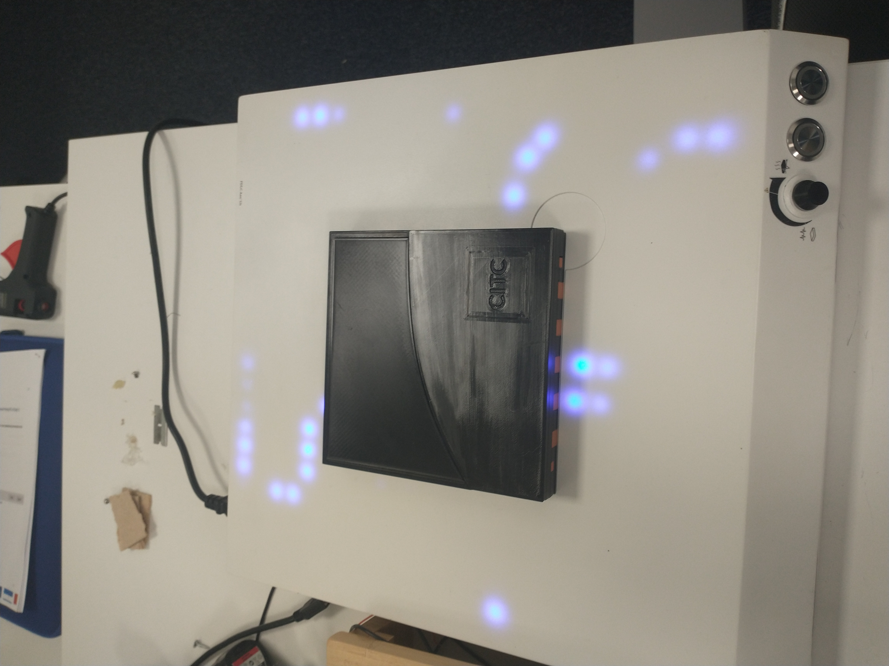

# Description
This repo contains the code for a scale model of a chip, used to show what would happen if you over worked the chip in question. Unfortunatly I could not, for the life of me, get video embedding in markdown to work (probably because the video was to big) so you will have to be content with going to the assets directory, and download the video from there (That is, if you want to see it of course).

